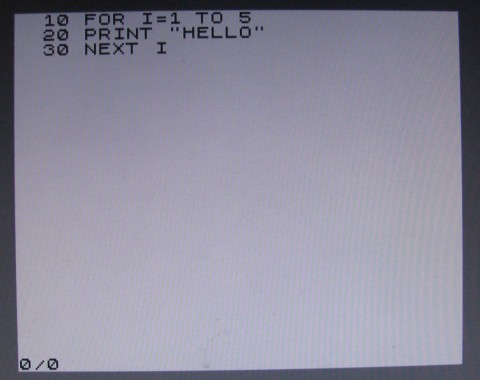

ZX81 emulator using FabGL
===========================

The great FabGL library created by Fabrizio Di Vittorio delivers above all graphics library for ESP32 in conjunction with a VGA monitor. In addition to its own library, on the basis of which you can build your own project, it also contains a number of examples for library usage. Among them are emulators of old 8-bit computers from the era about 40 years ago. E.g. here you will find computers Altair 8800, Commodore VIC-20 and even a 16-bit IBM XT computer with a number of optional operating systems.

The ZX81 microcomputer is probably known all over the world. It is the predecessor of the even better-known ZX Spectrum computer. Information on the ZX81 can be found, for example, at https://en.wikipedia.org/wiki/ZX81. The capabilities of the FabGL library make it easy to create an emulator of such a computer. And since the ZX Spectrum emulator was created before that, it was relatively easy to modify to a simpler computer.

ZX81 emulator requirements
---------------------------

*   On the HW side, the ESP32 WROVER module must be connected according to the diagram on the website http://www.fabglib.org . It is necessary to connect a VGA monitor and PS2 keyboard.
*   Install the Arduino IDE (tested with version 1.8.13 up to 1.8.19) with ESP32 support. The Arduino IDE must be supplemented with the FabGL library.
*   Place the folder that contains the two files ZX81.ino and zx81rom.h in the folder, where Arduino saves projects on your computer.
*   After opening the project, you should be able to load the program into the ESP32 memory (instructions are on the website). The settings are the same as for the other computers in the examples FabGL shown in video tutorials.
*   A microSD card is not required for the function.

The principle of the emulator program
-------------------------------------

The program mainly uses FabGL library classes for work. The graphical interface of the application is made up of the drawScanline function, which prepares individual points for display on a VGA monitor. Key presses on the connected PS2 keyboard are handled in the processKeyDown and processKeyUp functions. The actual emulation of the Z80 processor is done by an instance of the Z80 class.

The second library used in the program is SPIFFS. It is used to create "cassette recorder". Programs that would be stored on tape cassette are stored in ESP32 memory within SPIFFS as xxxx.Z81 files, where "xxxx" specifies the name entered in the ZX81 computer's "SAVE" command. Stored data (files on "cassette tape") remain in ESP32 memory until you overwrite them.

Using an emulator
-----------------

The program can be controlled via a connected PS2 keyboard. The Esc key resets the processor and the entire computer. There are 40 active keys on the keyboard, which correspond to the ZX81 keys. It is necessary to search for the instruction manual of the microcomputer on the web.

Conclusion
----------

In the FabGL library users gained a powerful tool for creating not only their own projects, but in the examples of emulated computers also a lot of older software created for completely different devices many years ago.

References
----------

http://www.fabglib.org  
https://github.com/fdivitto/FabGL  

* * *

Emulátor ZX81 pomocí FabGL
============================

Skvělá FabGL knihovna, kterou vytvořil Fabrizio Di Vittorio, přináší především grafickou knihovnu pro ESP32 ve spojení s VGA monitorem. Kromě vlastní knihovny, na jejímž základě můžete postavit vlastní projekt, obsahuje i řadu příkladů pro použití knihovny. Mezi nimi jsou i emulátory starých 8bitových počítačů z doby před asi 40 lety. Např. zde najdete počítače Altair 8800, Commodore VIC-20 a dokonce i 16bitový počítač IBM XT s řadou volitelných operačních systémů.

Mikropočítač ZX81 je asi známý po celém světě. Jde o předchůdce ještě známějšího počítače ZX Spectrum. Informace k ZX81 jsou např. na https://en.wikipedia.org/wiki/ZX81 . Možnosti knihovny FabGL dovolují snadno vytvořit emulátor takového počítače. A protože byl před tím vytvořen emulátor ZX Spectrum, byla úprava na jednodušší počítač poměrně snadná.

Požadavky pro emulátor ZX81
----------------------------

*   Po HW stránce musí být modul ESP32 WROVER zapojený podle schéma na stránkách http://www.fabglib.org . K modulu je potřeba připojit VGA monitor a PS2 klávesnici.
*   Na osobním počítači musí být instalováno Arduino IDE (testováno s verzí 1.8.13 až 1.8.19) s podporou ESP32. Arduino IDE se doplní o knihovnu FabGL.
*   Složku, která obsahuje dva soubory ZX81.ino a zx81rom.h umístěte do složky, kam Arduino ukládá na vašem počítači projekty.
*   Po otevření projektu byste měli být schopni nahrát program do paměti ESP32 (návody jsou na webu). Nastavení je stejné jako u dalších počítačů v příkladech FabGL ukázaných ve video návodech.
*   Pro funkci není potřeba mikroSD karta.

Princip programu emulátoru
--------------------------

Program využívá pro práci především třídy knihovny FabGL. Grafické rozhraní aplikace je tvořeno funkcí drawScanline, která připravuje jednotlivé body pro zobrazení na VGA monitoru. Zmáčknutí klávesy na připojené klávesnici PS2 je zpracováno ve funkcích procesKeyDown a procesKeyUp. Vlastní emulaci procesoru Z80 provádí instance třídy Z80.

Druhou knihovnou použitou v programu je SPIFFS. Ta slouží k vytvoření "kazetového magnetofonu". Programy, které by se ukládaly na kazetu, jsou v rámci SPIFFS ukládány do paměti ESP32 jako soubory xxxx.Z81, kde "xxxx" určuje jméno zadávané v příkazu "SAVE" počítače ZX81. Uložená data (soubory na "pásce kazetového magnetofonu") zůstávají v paměti ESP32 do doby, než je přepíšete.

Použití emulátoru
-----------------

Program je možné ovládat přes připojenou klávesnici PS2. Klávesa Esc vyvolá reset procesoru a celého počítače. Na klávesnici je pak aktivních 40 kláves, které odpovídají klávesám ZX81. Návod k použití mikropočítače je nutné hledat na webu.

Závěr
-----

V knihovně FabGL získali její uživatelé mocný nástroj na tvorbu nejen vlastních projektů, ale jak ukazují příklady emulovaných počítačů i na využití staršího software vytvořeného pro úplně jiná zařízení před mnoha lety.

Použitá literatura
------------------

http://www.fabglib.org  
https://github.com/fdivitto/FabGL